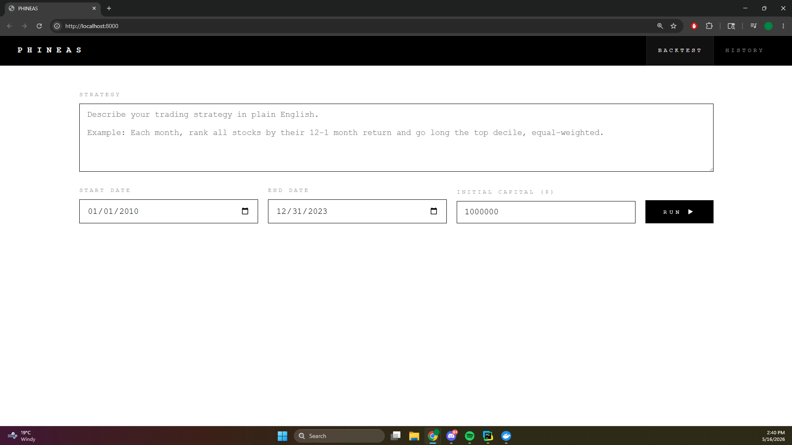
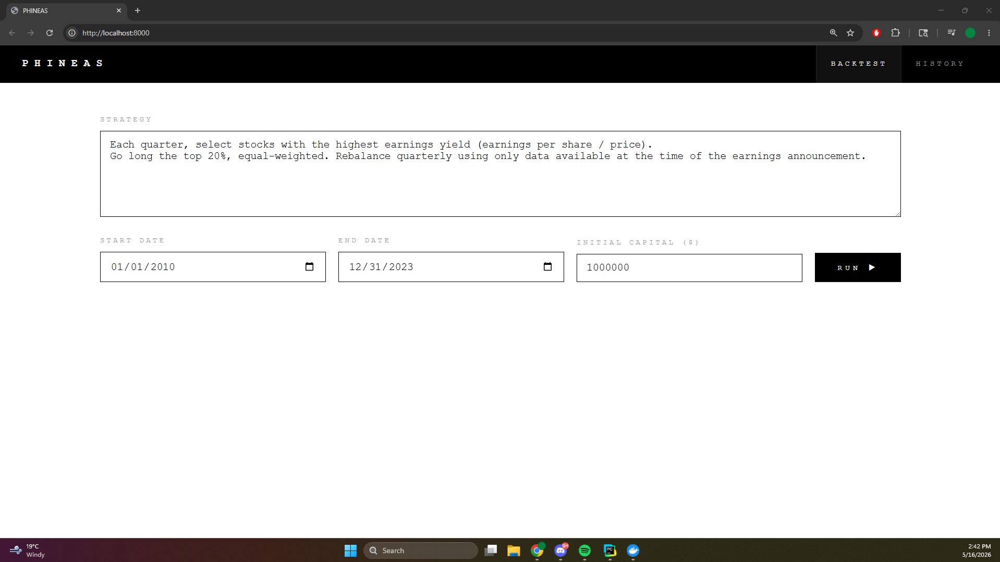
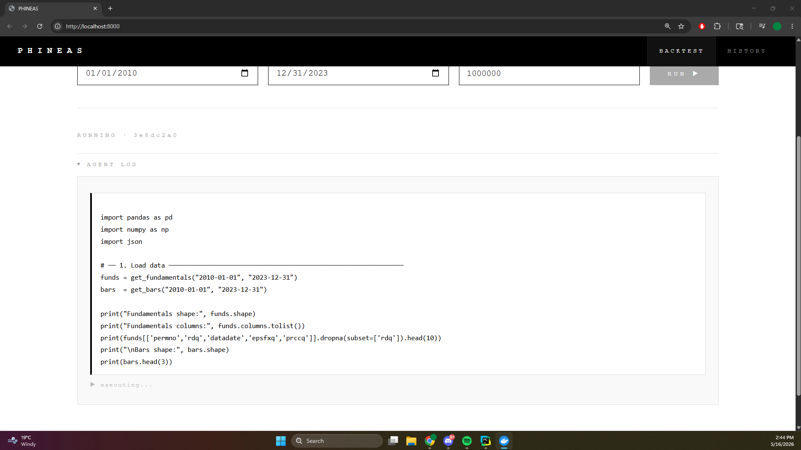
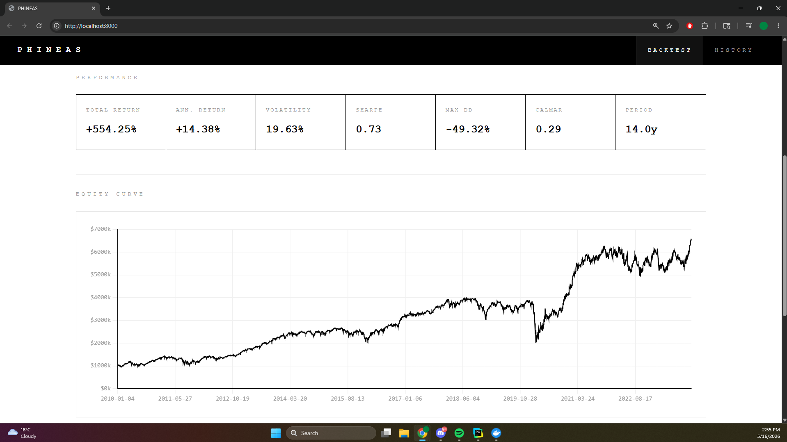

# Phineas

Phineas is a finance agent that takes an algorithmic trading strategy written in natural language, implements it as Python code, runs it against historical market data, and returns performance metrics and an equity curve.

The user never writes code. They describe a strategy — "go long the top momentum decile, rebalance monthly" — and the agent handles everything from signal construction to backtest execution.

---

## Demo

**1. Homepage**



This is Phineas: a super simple way to test algorithmic trading strategies using natural language.

**2. Enter your strategy**



Just describe your strategy in plain English. No code, no configuration.

**3. Watch the agent work**



The agent writes and executes Python code in real time. You can watch it reason through the implementation, hit errors, and self-correct — all streamed live.

**4. Results**



When the backtest completes you get a full tearsheet: total return, annualised return, volatility, Sharpe ratio, max drawdown, and Calmar ratio, alongside an equity curve and drawdown chart plotted over the full backtest period. Every run is saved to history so you can compare strategies side by side.

---

## How it works

### The agent loop

The core of Phineas is a tool-use loop powered by Claude Sonnet (`claude-sonnet-4-6`). The loop runs entirely server-side as an async background task.

```
User prompt (natural language strategy)
        │
        ▼
┌───────────────────┐
│  POST /backtest   │  returns job_id immediately
└────────┬──────────┘
         │ asyncio.create_task
         ▼
┌──────────────────────────────────────────────┐
│                Agent loop                    │
│                                              │
│  ┌─────────────┐   tool_use block            │
│  │   Claude    │ ──────────────────────────┐ │
│  │ Sonnet 4.6  │                           │ │
│  │             │ ◄─────────────────────────┘ │
│  └─────────────┘   tool_result               │
│        │                  ▲                  │
│        │  execute_python  │ stdout / stderr  │
│        ▼                  │                  │
│  ┌─────────────┐          │                  │
│  │  Preflight  │          │                  │
│  │  validator  │          │                  │
│  └──────┬──────┘          │                  │
│         │                 │                  │
│         ▼                 │                  │
│  ┌─────────────┐          │                  │
│  │  Subprocess │ ─────────┘                  │
│  │  sandbox    │                             │
│  └──────┬──────┘                             │
│         │                                    │
│         ▼                                    │
│   TimescaleDB  (CRSP + Compustat)            │
└──────────────────────────────────────────────┘
         │
         ▼
  SSE stream  →  GET /backtest/{id}/stream
  JSON result →  GET /backtest/{id}
```

The agent has one tool: `execute_python`. It writes backtest code, runs it, sees the output, and iterates until the strategy is correctly implemented. The full stdout/stderr from each execution is returned to the model as the tool result, so the agent can self-correct on errors.

The loop exits when the model returns `stop_reason: end_turn`, meaning it is satisfied with the result. The final code block is expected to `print(json.dumps(results))` with a structured result including performance metrics and an equity curve.

### The execution sandbox

Each `execute_python` call spawns a fresh subprocess via `asyncio.create_subprocess_exec`. There is no persistent REPL — state does not carry across calls. This is explicit in the system prompt; the agent is required to include all setup and data-loading code in every execution.

Before any subprocess is spawned, the code goes through a **preflight validator** (`ast.parse` + AST walk) that:
- Catches syntax errors and returns them immediately without burning subprocess time
- Blocks network imports (`requests`, `httpx`, `socket`, `subprocess`, `urllib`, etc.)
- Blocks shell execution and filesystem destruction (`.system()`, `.popen()`, `.rmtree()`)

Each subprocess inherits the parent environment, giving it access to the database credentials. A hard timeout of 120 seconds kills any runaway process.

### The sandbox preamble

Every subprocess is prepended with a preamble that injects helper functions into the execution context:

```python
get_bars(start_date, end_date)        # raw OHLCV
get_universe(start_date, end_date)    # OHLCV + header metadata joined
get_fundamentals(start_date, end_date)# Compustat joined to permno via link table
query(sql, *args)                     # arbitrary parameterised SQL
compute_metrics(returns, freq)        # Sharpe, max DD, Calmar, CAGR, etc.
```

The agent writes against this interface. It never needs to construct DB connections or know the DSN.

### Schema auto-generation

The system prompt's database schema section is generated at startup by querying `information_schema.columns` and injecting real column names and types. It is cached for the server lifetime. This means schema drift — a column rename, a new table — is reflected automatically on next restart rather than requiring a manual prompt update.

### The API

Three endpoints:

| Method | Path | Description |
|---|---|---|
| `POST` | `/backtest` | Submit a strategy. Returns `job_id` immediately. |
| `GET` | `/backtest/{id}` | Poll job status and final result. |
| `GET` | `/backtest/{id}/stream` | SSE stream of live agent events. |

Jobs run as `asyncio.Task` objects and survive client disconnects. The SSE stream replays all past events on reconnect, then follows live. Events are typed: `thinking`, `code`, `executing`, `code_output`, `done`, `agent_error`, `stream_end`.

---

## Data

The database is TimescaleDB (PostgreSQL 16) with two sources:

**CRSP** — daily US equity data going back to 1926
- `bars` — OHLCV, daily returns (with and without distributions), market cap
- `header` — security metadata: ticker, exchange, SIC code, active date range
- `adjustment` — cumulative price and volume adjustment factors

**Compustat** — quarterly fundamentals going back to ~1961
- `fundamentals_quarterly` — income statement, balance sheet, cash flow, EPS, shares outstanding
- `link` — CRSP↔Compustat identifier mapping with date-ranged validity

The link table is critical for correctly joining price and fundamental data. Queries against `fundamentals_quarterly` always filter by `link_primary IN ('P', 'C')` and respect `link_start_date` / `link_end_date` to avoid survivorship and look-ahead bias in the join.

---

## Stack

| Layer | Technology |
|---|---|
| Agent | Anthropic API — `claude-sonnet-4-6`, tool use |
| API | FastAPI + uvicorn, async throughout |
| Database | TimescaleDB / PostgreSQL 16 |
| DB client | asyncpg (API process), asyncpg in subprocess preamble |
| Package management | uv workspace (monorepo) |
| Frontend | Vanilla JS + Chart.js, served as a single static file |
| Containerisation | Docker Compose — `db` and `web` services |

The project is a uv workspace with three members: `apps/api`, `apps/fetcher`, and `libraries/models`. The fetcher is a separate CLI that pulls from the WRDS API and populates the database. The models library holds Pydantic schemas shared across packages.

---

## Running locally

**Prerequisites:** Docker, uv

```bash
# Start the database
docker compose up db -d

# Run DDL (first time only)
make setup

# Fetch data (first time only — takes hours)
make fetch-headers
make fetch-bars

# Start the API
make dev-api
```

Then open `http://localhost:8000`.

**Environment variables** (`.env` in root):

```
POSTGRES_USER=
POSTGRES_PASSWORD=
POSTGRES_DB=
ANTHROPIC_API_KEY=
WRDS_TOKEN=         # only needed for data fetching
```

---

## Engineering decisions

**Why tool use instead of a code-generation endpoint?**
A single `generate → run` flow has no recovery path. Tool use gives the agent a feedback loop — it sees errors and fixes them. In practice the agent self-corrects bad SQL, wrong column names, and type mismatches without any intervention.

**Why a subprocess sandbox instead of `exec()`?**
`exec()` shares the process memory and event loop. A subprocess is isolated, killable with a hard timeout, and produces clean stdout/stderr that maps naturally to the tool result the model reads. The tradeoff is cold start overhead (~200ms), which is acceptable given backtest runtimes are minutes.

**Why asyncpg over SQLAlchemy?**
asyncpg is a pure-async PostgreSQL driver with no ORM overhead. For heavy analytical queries against 70M+ row hypertables, direct SQL is preferable to any abstraction that might interfere with query planning.

**Why in-memory job store?**
For an MVP with a single server process, an in-memory dict keyed by `job_id` is zero-dependency and sufficient. The tradeoff is that jobs are lost on restart. A Redis-backed store would be the natural next step for persistence and multi-process scaling.

**Why SSE over WebSocket?**
The agent event stream is strictly server→client. SSE is unidirectional by design, has built-in reconnect, and works through standard HTTP/2. WebSocket adds bidirectional complexity that this use case doesn't need.
